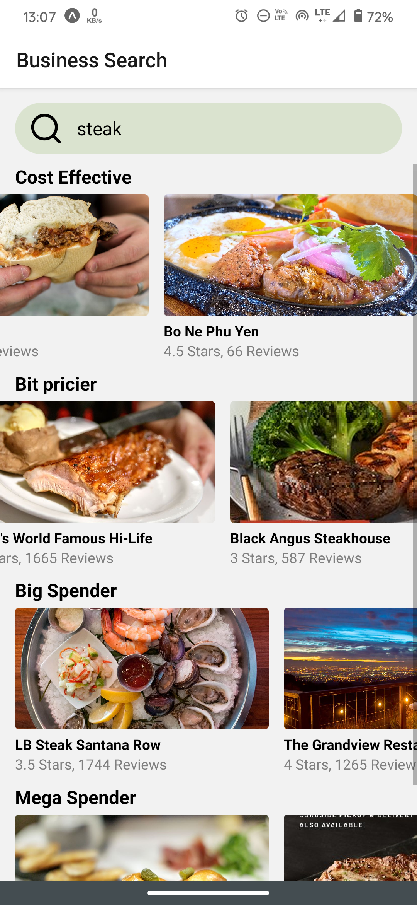
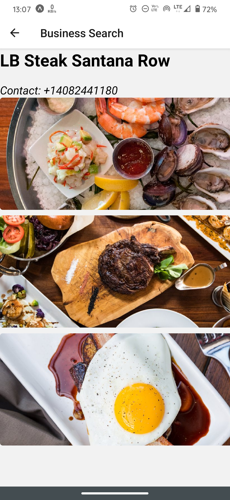

<!-- PROJECT LOGO -->
<br />
<p align="center">

   <h1 align="center">Foodie</h1>

  <p align="center">
   For those who love food
<br />
    <br />
    ·
    <a href="https://github.com/Harshitbhatt69/Foodie/issues">Report Bug</a>
    ·
    <a href="https://github.com/Harshitbhatt69/Foodie/issues">Request Feature</a>
    ·
    <br />

  </p>
</p>

<!-- TABLE OF CONTENTS -->


<!-- ABOUT THE PROJECT -->


## About The Project


This project aims to bring a  dinning experience, where the customers coming to the restaurant can see what food he can enjoy in restaurant. 



### Built With

<p float ="right">


</p>
<!-- GETTING STARTED -->


## Getting Started
To get a local copy up and for running the project locally, follow these simple steps.

### Prerequisites

Install node,npm & Expo

[Install npm](https://www.npmjs.com/get-npm)

[Install Expo](https://docs.expo.io/)


### Installation

1. Clone the repo

```sh
git clone https://github.com/Harshitbhatt69/Foodie.git
```

3. Install Expo Cli if you haven't already

```sh
npm install -g expo-cli
```

3. Install packages

```sh
npm install
```

4. Build expo project and Run the bundler

```sh
expo start
```

<!-- USAGE EXAMPLES -->


<!-- ROADMAP -->

## Roadmap

See the [open issues](https://github.com/Harshitbhatt69/Foodieissues) for a list of proposed features (and known issues).

<!-- CONTRIBUTING -->

## Contributing

Contributions are what make the open source community such an amazing place to be learn, inspire, and create. Any contributions you make are **greatly appreciated**.

1. Fork the Project
2. Create your Feature Branch (`git checkout -b feature/AmazingFeature`)
3. Commit your Changes (`git commit -m 'Add some AmazingFeature'`)
4. Push to the Branch (`git push origin feature/AmazingFeature`)
5. Open a Pull Request

<!-- CONTACT -->


<p align = "center" >Made with :purple_heart: for :india: </p>
